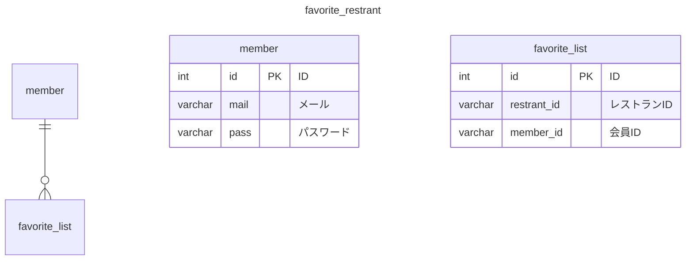

# 簡易仕様書

### 作者
長力淳
### アプリ名
My Favorite Restraint

#### コンセプト
近く気になるお店のマイリスト

#### こだわったポイント
スマホで使用することを想定し、シンプルで使いやすさを重視しました

#### デザイン面でこだわったポイント
食を扱うため、食欲を増進効果が黄色を基調としたデザインにした

### 該当プロジェクトのリポジトリ URL（GitHub,GitLab など Git ホスティングサービスを利用されている場合）
https://github.com/j-choriki/MyfavoriteList.git

## 開発環境
### 開発環境
Visual Studio code
バージョン: 1.84.2 (Universal)

### 開発言語
PHP 7.4.21
JavaScript
HTML5
CSS3
jquery-3.4.1

## 動作対象端末・OS
### 動作端末
iPhone SE (375×667)

## 開発期間
9日間

## アプリケーション機能

### 機能一覧
- レストラン範囲検索：ホットペッパーグルメサーチAPIを使用して、現在地周辺の飲食店を検索する。
- レストラン情報取得：ホットペッパーグルメサーチAPIを使用して、飲食店の詳細情報を取得する。
- 会員登録機能：会員登録を行う 
- ログイン機能：会員機能を使うためにログインを行う
- お気に入り登録機能：お気に入りのお店の登録を行う機能
- お気に入り情報の取得機能：自身お気に入り登録した一覧情報を取得する
- お気に入り削除機能：お気に入り登録した情報を一覧から削除する機能

### 画面一覧
- ホーム画面 ：ページ訪問時から半径300mのレストラン一覧を表示できる。また範囲検索をこのページから行うため検索画面・検索結果画面も兼ねている。
- レストラン詳細画面：お店の詳細情報を表示する画面。ホットペッパーサイトへの遷移,ホットペッパーサイト掲載の地図情報の表示ページへの遷移,お気に入り登録ボタンあり。
- 会員登録画面 ：会員登録する画面
- ログイン画面 ：ログインする画面
- お気に入り一覧画面：お気に入り登録したレストラン一覧を表示する画面

### 使用しているAPI,SDK,ライブラリなど
- ホットペッパーグルメサーチAPI
- Geolocation API

### アドバイスして欲しいポイント
コードの記述の仕方や、ご自身であればどういったコードや書き方をするか、またデザインをする上で気をつけるポイントをご教示願いたい

### 自己評価
#### 反省点
制作に時間がかかりすぎな点。
Jsをもっとシンプルに記述できないか検討が必要。
デザインはシンプルだがも陳腐に感じてしまう。

#### 良好点
サーバー側の非同期の通信のプログラムを一つのページにまとめた点

# テーブル定義

